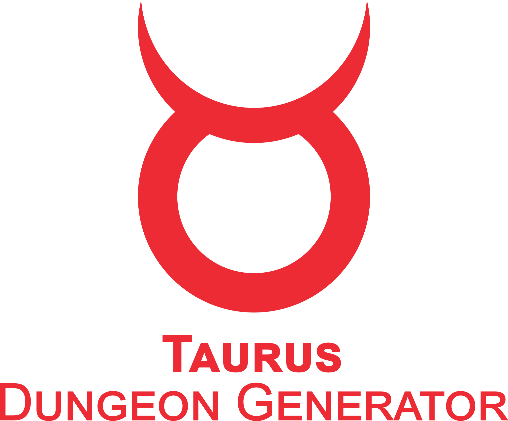

# TaurusDungeonGenerator v0.8

#### A graph based procedural dungeon generator for Unity

* [Download Playable Presentation](https://drive.google.com/drive/folders/1XDA1_g5tuvnb2khWiTpZuK7bcmDJAn89)
* [Download Example Project](https://drive.google.com/file/d/1Oz-4GnO_038RL4KZUholrGePtJirvCOE/view?usp=sharing)
* ~~Asset Store Link~~


## Features
* Abstract graph structure definition
* Store and load structures from config with <a href="https://github.com/SolAnna7/PiscesConfigLoader">PiscesConfigLoader</a>
* Quick layout generation (not using Unity space!)
* Reusing dungeon plans by nesting
* Main path and branch generation
* Add meta data using tags and properties
* Optional paths
* Margin between elements
* Debug view

## System Requirements

* Unity 2018.4 or later

## Dependencies

* [UnityOctree](https://github.com/Nition/UnityOctree) (as git submodule) 
* [Unity-Reorderable-List](https://github.com/cfoulston/Unity-Reorderable-List) (as git submodule) 
* [PiscesConfigLoader](https://github.com/SolAnna7/PiscesConfigLoader) (optional, separately installed dependency)

## Installation

* Clone into the Assets folder of your Unity project
```
git clone git@github.com:SolAnna7/TaurusDungeonGenerator.git
cd TaurusDungeonGenerator/
git submodule update --init --recursive
```
* ~~Download from Unity Asset Store~~
* To load the dungeon structures from config files use the [PiscesConfigLoader](https://github.com/SolAnna7/PiscesConfigLoader)

## Usage

##### Create your room assets
* Add the `Room` component to the root
  
* Setup your doors with `RoomConnector` component
  
* Collect your rooms into `RoomCollection`-s for randomized usage

##### Define your dungeon structure
* In code
 ```c#
  AbstractDungeonStructure.Builder
      .SetEmbeddedDungeons(new Dictionary<string, AbstractDungeonStructure>
      {
          {
              //branch type 1 definition
              "inline-branch-1",
              AbstractDungeonStructure.Builder.SetStartElement(
                  ConnectionElement("DungeonGenerationTest/Corridors", new RangeI(4, 7))
                      .AddSubElement(
                          NodeElement("DungeonGenerationTest/MiddleRoom")
                      ).Build()).Build()
          },
          {
              //branch type 2 definition
              "inline-branch-2",
              AbstractDungeonStructure.Builder.SetStartElement(
                  ConnectionElement("DungeonGenerationTest/Corridors", new RangeI(2, 5))
                      .AddSubElement(
                          NodeElement("DungeonGenerationTest/CorrX")
                      ).Build()).Build()
          }
      })
      .SetBranchData(new BranchDataWrapper(
          // the types of dungeons used as branches
          new List<string> {"inline-branch-1", "inline-branch-2"},
          // maximum percentage of empty connections where branches will be built
          50f))
      .SetMetaData(StructureMetaData.Builder
          // meta data objects for the structure
          .AddStructureProperty("name", "Realistic dungeon layout")
          .AddStructureProperty("description", "A realistic layout with one miniboss room, one boss room and one to three exits.")
          // tags for the structure
          .AddStructureTag("structure-tag-1")
          .AddStructureTag("structure-tag-2")
          // tags for every element
          .AddGlobalTag("global-node-tag-1")
          .Build())
      // the actual structure of the dungeon graph
      .SetStartElement(
          // a single room chosen from the DungeonGenerationTest/EndRoom RoomCollection
          NodeElement("DungeonGenerationTest/EndRoom")
              // tags for this node
              .SetMetaData(NodeMetaData.Builder.AddTag("entrance").Build())
              .AddSubElement(
                  // a sequence of connected rooms chosen from the DungeonGenerationTest/Corridors RoomCollection
                  // the length of the sequence is between 5 and 10 rooms randomly chosen at generation
                  ConnectionElement("DungeonGenerationTest/Corridors", new RangeI(5, 10))
                      .AddSubElement(
                          NodeElement("DungeonGenerationTest/MiddleRoom")
                              .SetMetaData(NodeMetaData.Builder.AddTag("small-boss-room").Build())
                              .AddSubElement(
                                  ConnectionElement("DungeonGenerationTest/Corridors", new RangeI(5, 10))
                                      .AddSubElement(
                                          NodeElement("DungeonGenerationTest/CorridorsNormalBig")
                                              .AddSubElement(
                                                  ConnectionElement("DungeonGenerationTest/CorridorsBig", new RangeI(3))
                                                      .AddSubElement(
                                                          NodeElement("DungeonGenerationTest/BigRoom")
                                                              .SetMetaData(NodeMetaData.Builder.AddTag("big-boss-room").Build())
                                                              .AddSubElement(
                                                                  NodeElement("DungeonGenerationTest/CorridorsNormalBig")
                                                                      .AddSubElement(
                                                                          ConnectionElement("DungeonGenerationTest/Corridors", new RangeI(5, 10))
                                                                              .AddSubElement(
                                                                                  NodeElement("DungeonGenerationTest/MiddleRoom")
                                                                                      .AddSubElement(
                                                                                          ConnectionElement("DungeonGenerationTest/Corridors", new RangeI(5, 10))
                                                                                              .AddSubElement(NodeElement("DungeonGenerationTest/EndRoom")
                                                                                                  .SetMetaData(NodeMetaData.Builder.AddTag("exit-1-static").Build())
                                                                                                  .Build())
                                                                                              .Build())
                                                                                      .AddSubElement(
                                                                                          ConnectionElement("DungeonGenerationTest/Corridors", new RangeI(5, 10))
                                                                                              // this part of the tree is optional
                                                                                              .SetMetaData(NodeMetaData.Builder.SetOptionalNode().Build())
                                                                                              .AddSubElement(NodeElement("DungeonGenerationTest/EndRoom")
                                                                                                  .SetMetaData(NodeMetaData.Builder
                                                                                                      .AddTag("exit-2-optional")
                                                                                                      // end of an optional tree
                                                                                                      .SetOptionalEndpoint()
                                                                                                      .Build())
                                                                                                  .Build())
                                                                                              .Build())
                                                                                      .AddSubElement(
                                                                                          ConnectionElement("DungeonGenerationTest/Corridors", new RangeI(5, 10))
                                                                                              .SetMetaData(NodeMetaData.Builder.SetOptionalNode().Build())
                                                                                              .AddSubElement(NodeElement("DungeonGenerationTest/EndRoom")
                                                                                                  .SetMetaData(NodeMetaData.Builder
                                                                                                      .AddTag("exit-3-optional")
                                                                                                      .SetOptionalEndpoint()
                                                                                                      .Build())
                                                                                              )))))))))))
              .Build())
      .Build()
```
  
* Or load from config files using <a href="https://github.com/SolAnna7/PiscesConfigLoader">PiscesConfigLoader</a>
  
 ```yaml
  realistic-dungeon-layout-1:
    inline-nested:
      # branch type 1 definition
      inline-branch-1:
        start-node:
          connection: DungeonGenerationTest/Corridors
          length: 4_7
          subs:
            - node: DungeonGenerationTest/MiddleRoom
      # branch type 2 definition
      inline-branch-2:
        start-node:
          connection: DungeonGenerationTest/Corridors
          length: 2_5
          subs:
            - node: DungeonGenerationTest/CorrX
    # the types of dungeons used as branches
    branch-prototypes:
      - inline-branch-1
      - inline-branch-2
    # maximum percentage of empty connections where branches will be built
    branch-max-percent: 50
    # meta data objects for the structure
    structure-properties:
      name: "Realistic dungeon layout"
      description: "A realistic layout with one miniboss room, one boss room and one to three exits."
    # tags for the structure
    structure-tags:
      - structure-tag-1
      - structure-tag-2
    # tags for every element
    global-node-tags:
      - global-node-tag-1
    # the actual structure of the dungeon graph
    start-node:
      # a single room chosen from the DungeonGenerationTest/EndRoom RoomCollection
      node: DungeonGenerationTest/EndRoom
      # tags for this node
      tags:
        - entrance
      subs:
        # a sequence of connected rooms chosen from the DungeonGenerationTest/Corridors RoomCollection
        - connection: DungeonGenerationTest/Corridors
          # the length of the sequence is between 5 and 10 rooms randomly chosen at generation
          length: 5_10
          subs:
            - node: DungeonGenerationTest/MiddleRoom
              tags:
                - small-boss-room
              subs:
                - connection: DungeonGenerationTest/Corridors
                  length: 5_10
                  subs:
                    - node: DungeonGenerationTest/CorridorsNormalBig
                      subs:
                        - connection: DungeonGenerationTest/CorridorsBig
                          length: 3
                          subs:
                            - node: DungeonGenerationTest/BigRoom
                              tags:
                                - big-boss-room
                              subs:
                                - node: DungeonGenerationTest/CorridorsNormalBig
                                  subs:
                                    - connection: DungeonGenerationTest/Corridors
                                      length: 5_10
                                      subs:
                                        - node: DungeonGenerationTest/MiddleRoom
                                          subs:
                                            - connection: DungeonGenerationTest/Corridors
                                              length: 5_10
                                              subs:
                                                - node: DungeonGenerationTest/EndRoom
                                                  optional-end: true
                                                  tags:
                                                    - exit-1-static
                                            - connection: DungeonGenerationTest/Corridors
                                              length: 5_10
                                              # this part of the tree is optional
                                              optional: true
                                              subs:
                                                - node: DungeonGenerationTest/EndRoom
                                                  # end of an optional tree
                                                  optional-end: true
                                                  tags:
                                                    - exit-2-optional
                                            - connection: DungeonGenerationTest/Corridors
                                              length: 5_10
                                              optional: true
                                              subs:
                                                - node: DungeonGenerationTest/EndRoom
                                                  optional-end: true
                                                  tags:
                                                    - exit-3-optional
```

##### Parameterise and generate your dungeon, then build it in unity space

```c#
PrototypeDungeonGenerator generator = new PrototypeDungeonGenerator(inputStructure, 
                                                                    seed, 
                                                                    new PrototypeDungeonGenerator.GenerationParameters {RequiredOptionalEndpointNumber = optionalPathNumber});
PrototypeDungeon prototypeDungeon = generator.BuildPrototype();
DungeonStructure builtStructure = prototypeDungeon.BuildDungeonInUnitySpace(transform);
```
##### 🎆🎆🎆 Profit 🎆🎆🎆 

### Nested Dungeons

Reuse dungeons as subtrees
Can continue with children
Can be defined as global (used from any other dungeon) or inline (reusable only in one main dungeon)

```yaml
example-dungeons:

  global-nestable-dungeon:
    start-node:
      connection: DungeonGenerationTest/Corridors
      length: 1_3
      subs:
        - node: DungeonGenerationTest/MiddleRoom

  nesting-presentation:
    start-node:
      node: DungeonGenerationTest/EndRoom
      subs:
        - connection: DungeonGenerationTest/Corridors
          length: 10_20
          subs:
            - node: DungeonGenerationTest/CorrX
              subs:
                # this nested dungeon continues have child nodes
                - nested: example-dungeons.global-nestable-dungeon
                  subs:
                    - connection: DungeonGenerationTest/Corridors
                      length: 1_3
                      subs:
                        - node: DungeonGenerationTest/EndRoom
                - nested: example-dungeons.global-nestable-dungeon

```

### Branches


After creating the main tree, other low priority paths can be added. This can be used as a way to add complexity and dead-ends to a dungeon.
The brances are defined as nested dungeons (global or inline)
Set the maximum number of unused connectors where brances are tried to be generated. Either as percent `branch-max-percent: 50` or as a number `branch-max-num: 12`

```yaml
  realistic-dungeon-layout-1:
    inline-nested:
      # branch type 1 definition
      inline-branch-1:
        start-node:
          connection: DungeonGenerationTest/Corridors
          length: 4_7
          subs:
            - node: DungeonGenerationTest/MiddleRoom
      # branch type 2 definition
      inline-branch-2:
        start-node:
          connection: DungeonGenerationTest/Corridors
          length: 2_5
          subs:
            - node: DungeonGenerationTest/CorrX
    # the types of dungeons used as branches
    branch-prototypes:
      - inline-branch-1
      - inline-branch-2
    # maximum percentage of empty connections where branches will be built
    branch-max-percent: 50
...
```

### Optional paths

Some subtrees of the main path can be marked as **optional** and nodes inside them as **optional-end**.
At generation the required number of optional endpoints can be set.
Use-Case: Reusing the same dungeon with different number of exits.

### Margin between elements

Add additional margin between elements
*This is still an experimental feature*

```c#
structure.StructureMetaData.MarginUnit = 0.5f;
```

### Debug view

Use the `DungeonDebugger` static class to
* Draw in-editor gizmos around the dungeon element with color coded information
* Generate a debug structure using unity cubes with the same colors
* Generate debug description text


## Planned features

### v0.9
* Room repetition control
* Path straightness/~~gayness~~ curvedness control
### v1.0
* Unity Editor extension for dungeon structure creation
### ?
* Optional handling refactor: Activate optional paths based on room tags
* Circles in the layout
* Variables: Define variables (like random ranges) to reuse in the structure
* Bounding box for the dungeon
